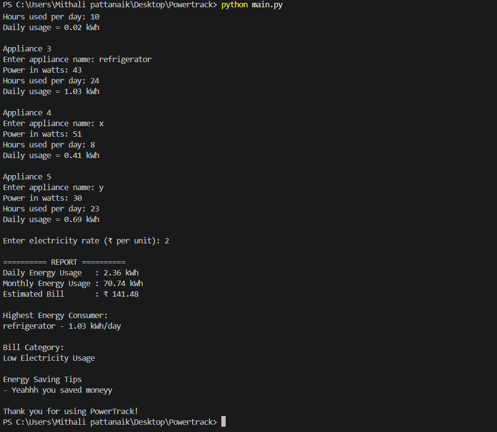

# PowerTrack{Electricity Usage Calculator}

## About
PowerTrack is a simple Python project that calculates electricity consumption of household appliances.
It estimates monthly energy usage, predicts electricity bills and identifies the appliance consuming the most energy.

## Features
- Daily energy calculation
- Monthly energy estimation
- Bill prediction
- Highest energy consuming appliance
- Energy saving suggestions

## Technology

- Python

## How to Run

python main.py

## Screenshot

